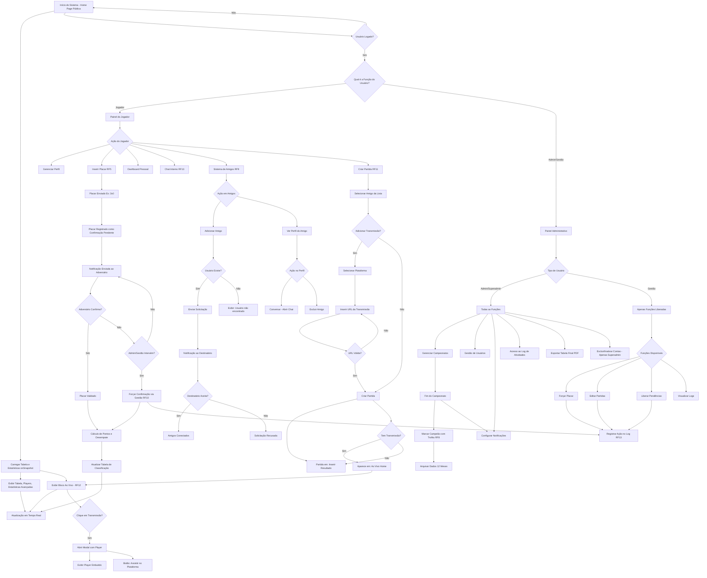

## 📄 Product Requirements Document (PRD) - iCouFootball

| Detalhe | Valor |
| :--- | :--- |
| **Nome do Produto** | iCouFootball |
| **Versão** | 2.0 |
| **Data** | 12 de Dezembro de 2025 |
| **Desenvolvimento** | HTML5, CSS e JavaScript (Vanilla - Sem Frameworks) |
| **Idioma Padrão** | Português (Brasil) |
| **Cores Primárias** | **\#FD8A24** (Laranja) e **\#605F54** (Cinza Escuro) |

-----

## 1\. 🎯 Visão Geral do Produto

O iCouFootball é um **sistema de gerenciamento e exibição de estatísticas** para campeonatos de **FC25 (EAFC)**, focado em proporcionar uma experiência **pública, dinâmica e confiável** para o acompanhamento de competições no formato de **Pontos Corridos**. O sistema deve ser **fácil de usar** tanto para a administração quanto para os jogadores, com foco em uma interface **limpa e responsiva**, seguindo a identidade visual com as cores primárias **\#FD8A24** e **\#605F54**.

-----

## 2\. 🚀 Metas do Produto

  * **Transparência:** Fornecer uma página inicial totalmente **pública** e atualizada **em tempo real** com as estatísticas do campeonato.
  * **Confiabilidade:** Implementar um sistema de **validação de placar (Fair Play)** e critérios de desempate **robustos**.
  * **Gestão Simplificada:** Oferecer um painel de controle **intuitivo** para Administradores gerenciarem campeonatos, rodadas e usuários.
  * **Experiência do Jogador:** Dar **autonomia** aos jogadores para gerenciar seus perfis e inserir resultados.

-----

## 3\. 👥 Público-Alvo e Casos de Uso

| Público-Alvo | Função Principal | Casos de Uso Chave |
| :--- | :--- | :--- |
| **Público Geral** | Consumo de Informação | Acompanhar a tabela de classificação e estatísticas de jogadores em tempo real. |
| **Jogador** | Participação e Atualização | Inserir placares, gerenciar perfil, recuperar senha, interagir no chat. |
| **Administrador** | Gestão Total | Iniciar/Finalizar campeonatos, forçar placares, gerenciar usuários, configurar rodadas. |

-----

## 4\. ✨ Requisitos de UI/UX e Estilo

| Requisito | Detalhamento |
| :--- | :--- |
| **Identidade Visual** | Uso das cores **\#FD8A24 (Laranja)** para destaque e **\#605F54 (Cinza Escuro)** para fundo ou elementos secundários. |
| **Design** | O design deve ser moderno e alinhado com os templates fornecidos. Deve ser **totalmente responsivo (Mobile First)**. |
| **Modo Escuro** | O sistema deve suportar e ter o **Modo Escuro como padrão** ou com fácil alternância. |
| **Imagens de Perfil** | Uso de **placeholder ou fallback** para imagens de perfil (jogadores/times) caso o ImgBB não carregue. |
| **Acessibilidade** | Garantir **contraste suficiente**, especialmente entre o texto e o fundo (importante no modo escuro). |

-----

## 5\. 🛠️ Requisitos Funcionais (RF)

### RF1: Home Page (Pública)

  * **Exibição de Estatísticas:** A página inicial deve exibir, **sem necessidade de login**, a tabela atual do campeonato em Pontos Corridos.
  * **Tabela Dinâmica:** A tabela deve ser atualizada em **tempo real** via `onSnapshot` do Firestore assim que um placar for confirmado.
  * **Tabela de Classificação:** Deve listar o ranking por: **Pontos (P), Vitórias (V), Saldo de Gols (SG), Gols Pró (GP), Gols Contra (GC)**, e o critério de desempate (**Confronto Direto**).
  * **Lista de Players:** Exibição da lista de jogadores com nome, time e o nível de estrelas (parcialmente).
  * **Estatísticas Avançadas:** Exibir métricas como Melhor Ataque, Melhor Defesa, Maior Goleada, etc.

### RF2: Autenticação e Perfis

  * **Mecanismo de Autenticação:** Uso de **Firebase Authentication** (e-mail/senha) e `signInWithCustomToken`.
  * **Tipos de Usuário:**
      * **Administrador (Admin):** Controle total do sistema e gestão de usuários.
      * **Jogador:** Permissões limitadas, foco na participação e gestão do próprio perfil/placar.
  * **Recuperação de Senha:** Funcionalidade padrão via Firebase Auth (enviar link para e-mail).

### RF3: Gerenciamento de Usuários e Permissões

| Funcionalidade | Jogador | Usuário com Gestão | Administrador | Superadmin |
| :--- | :--- | :--- | :--- | :--- |
| Inserir Placar | Sim | Sim | Sim | Sim |
| Editar/Remover Placar | Não | Configurável* | Sim | Sim |
| Forçar Confirmação Placar | Não | Configurável* | Sim | Sim |
| Excluir Própria Conta | Sim | Sim | Sim | Sim |
| Excluir Conta de Terceiros | Não | **Não** | Não | **Sim** |
| Inativar Jogador | Não | **Não** | Não | **Sim** |
| Mudar Foto de Perfil | Sim (Validação: .jpg/.png \< 2MB, ImgBB) | Sim | Sim | Sim |
| Escolher Time | Sim (API-Football) | Sim | Sim | Sim |
| Adicionar/Mudar Funções | Não | Não | Sim | Sim |
| Iniciar/Finalizar Campeonato | Não | Configurável* | Sim | Sim |
| Adicionar Amigos | Sim | Sim | Sim | Sim |
| Criar Partida com Amigo | Sim | Sim | Sim | Sim |
| Acessar Gestão | Não | Sim | Sim | Sim |
| Visualizar Logs | Não | Configurável* | Sim | Sim |

**\* Configurável:** Admin/Superadmin define individualmente quais permissões cada usuário com Gestão possui.

### RF4: Gerenciamento de Campeonatos e Rodadas

  * **Sistema de Pontos Corridos:** A lógica do sistema deve calcular pontos (**Vitória: 3, Empate: 1, Derrota: 0**) e atualizar a tabela.
  * **Registro de Data/Hora:** O sistema deve registrar a data e hora de início e fim de cada campeonato para fins de histórico.
  * **Rodadas Fixas:** O Administrador deve poder **pré-definir todos os confrontos** de todas as rodadas antes do início do campeonato.
  * **Arquivamento:** Campeonatos finalizados serão armazenados e consultáveis por no máximo **12 meses**.
  * **Exportação:** O Administrador deve poder exportar a tabela final do campeonato em formato **PDF**.

### RF5: Inserção e Validação de Placar (Fair Play)

  * **Lançamento de Placar:** O Jogador insere o placar (ex: 3x0). O sistema registra o resultado como **"Confirmação Pendente"**.
  * **Notificação de Pendência:** O Jogador adversário (B) recebe uma **notificação** (no painel e/ou e-mail) informando sobre o placar pendente.
  * **Confirmação:** O Jogador B deve clicar em **"Confirmar"** para que o placar seja validado e os pontos sejam atualizados na tabela.
  * **Disputa/Forçar:** O Administrador pode, a qualquer momento, **forçar a confirmação** do placar em caso de disputa ou inércia de um dos jogadores.

### RF6: Critério de Desempate (Confronto Direto)

  * **Lógica da Tabela:** A ordenação da tabela segue a ordem padrão dos Pontos Corridos.
  * **Regra de Desempate:** Se **Pontos, Vitórias e Saldo de Gols** forem iguais entre dois ou mais times, o **Confronto Direto** será o critério de desempate final.

### RF7: Estatísticas e Visualização

  * **Dashboard Pessoal (Jogador):** Seção privada para exibir estatísticas detalhadas por campeonato:
      * Percentual de Vitórias/Empates/Derrotas.
      * Média de Gols por Partida (GP).
      * Histórico de Confrontos (vs. outros jogadores).
  * **Estatísticas Avançadas (Geral):**
      * Melhor Ataque (Maior GP).
      * Melhor Defesa (Menor GC).

### RF8: Perfis de Jogadores

  * **Gestão de Perfil (Jogador):** O Jogador pode adicionar/editar: Nome, Nome do Time, Descrição, Links de Redes Sociais, Contato.
  * **Visibilidade do Perfil:**
      * **Público:** Todas as informações são exibidas na Home Page (Lista de Players).
      * **Privado:** Apenas Nome, Time e a quantidade de Estrelas (parcial) são exibidos publicamente.
  * **Sistema de Estrelas:**
      * Cada campeonato vencido confere **uma estrela**.
      * Máximo de **5 estrelas visíveis**.
      * Se ultrapassar 5, o número total só é revelado ao posicionar o mouse (tooltip) sobre as estrelas.
  * **Troféu de Campeão:** Jogadores que venceram o último campeonato exibem um **ícone de troféu** em seus perfis.

### RF9: Sistema de Amigos

  * **Acesso:** Menu no **avatar-popover** com opção "Amigos".
  * **Adicionar Amigo:**
      * Botão "Adicionar amigo" abre input para digitar o nome do usuário.
      * Sistema busca no Firestore (`users` collection) por `nome` exato ou parcial.
      * **Se encontrado:** Envia solicitação de amizade e notificação ao usuário.
      * **Se não encontrado:** Exibe mensagem "Usuário não encontrado".
  * **Solicitações de Amizade:**
      * Solicitações aparecem em uma **seção separada** no modal de Amigos.
      * Destinatário pode **Aceitar** ou **Recusar** a solicitação.
      * Ambos os usuários devem estar conectados para aparecer na lista de amigos.
  * **Lista de Amigos:**
      * Exibe para cada amigo:
          * **Nome** do amigo
          * **Estrelas** (máximo 5 visíveis, total em tooltip)
          * **Ícone de Troféu** (se venceu o último campeonato)
          * **Botão "Ver Perfil"**
  * **Perfil do Amigo (Modal):**
      * Ao clicar em "Ver Perfil", abrir modal com:
          * Nome completo
          * Time escolhido (nome + logo)
          * Estrelas de campeonato
          * Troféu (se aplicável)
          * **Botões de ação:**
              * **"Conversar":** Abre o chat direto com o amigo
              * **"Excluir amigo":** Remove da lista de amigos (confirmação obrigatória)
  * **Notificações:**
      * Notificação de nova solicitação de amizade
      * Notificação quando solicitação é aceita

### RF10: Gestão por Usuário (Permissões Granulares)

  * **Acesso:** Menu no **avatar-popover** com opção "Gestão" (visível apenas para usuários com permissões).
  * **Permissões Liberadas:**
      * O Administrador define **individualmente** quais funções cada usuário pode executar.
      * Exemplos de funções:
          * Forçar placar
          * Liberar pendências de Fair Play
          * Editar informações de partidas
          * Iniciar/Finalizar rodadas
          * Gerenciar notificações
          * Visualizar logs do sistema
  * **Função Restrita (Superadmin):**
      * **Excluir/Inativar contas de terceiros** é permitido APENAS ao Superadmin.
      * Jogadores com permissões de Gestão NÃO podem excluir/inativar outras contas.
  * **Interface do Modal:**
      * Exibe apenas as funções liberadas para o usuário atual.
      * Cada função deve ter descrição clara e confirmação antes de executar.
  * **Log de Ações de Gestão:**
      * Todas as ações realizadas via Gestão são registradas no log com:
          * Usuário responsável
          * Ação executada
          * Data/hora
          * Detalhes da ação

### RF11: Criação de Partidas entre Amigos

  * **Acesso:** Sessão **Partidas**, bloco "Criar Partida".
  * **Fluxo de Criação:**
      * **Passo 1:** Usuário seleciona um amigo da sua lista de amigos (dropdown).
      * **Passo 2:** Confirma a criação da partida.
      * **Sem Permissão Prévia:** A partida é criada sem necessidade de o amigo aceitar previamente.
  * **Status da Partida:**
      * Partida criada entra com status **"Aguardando Resultado"**.
      * Aparece no bloco **"Inserir Resultado"** para o criador.
  * **Link de Transmissão:**
      * Criador pode adicionar link de transmissão ao criar a partida.
      * **Seletor de Plataforma:** Dropdown com opções (YouTube, Twitch, Kick, Facebook Gaming, etc.).
      * **Input de URL:** Habilitado APENAS após selecionar uma plataforma.
      * Se link fornecido, partida aparece na **Home Page pública** no bloco "Ao Vivo".
  * **Inserção de Resultado:**
      * Criador insere o placar (ex: 3x1).
      * Resultado entra em **"Confirmação Pendente"**.
      * Amigo recebe notificação para confirmar no bloco **"Partidas Pendentes de Ação (Fair Play)"**.
  * **Validação Fair Play:**
      * Segue mesma lógica do RF5.
      * Após confirmação, pontos são calculados e tabela atualizada.
  * **Partidas Oficiais vs. Amistosas:**
      * *(Assunção)* Partidas entre amigos são consideradas **oficiais** e contam pontos no campeonato ativo.
      * Se necessário partidas amistosas (não oficiais), adicionar flag `oficial: boolean`.

### RF12: Bloco "Ao Vivo" na Home Page

  * **Localização:** Home Page pública, seção destacada acima ou ao lado da tabela de classificação.
  * **Conteúdo:**
      * Exibe partidas **com transmissão ativa** (link de transmissão fornecido).
      * Cada item mostra:
          * **"Time A vs Time B - HH:MM"** (horário de início da partida)
          * Ícone da plataforma de streaming
          * Status "AO VIVO" (badge vermelho pulsante)
  * **Interação:**
      * Ao clicar no item, abre **modal com player embutido** da plataforma (embed do YouTube, Twitch, etc.).
      * Modal contém:
          * Player de vídeo embutido (iframe responsivo)
          * Botão **"Assistir no [Plataforma]"** que abre a transmissão em nova aba na origem.
          * Informações da partida: Jogadores, times, placar atual (se disponível).
  * **Atualização em Tempo Real:**
      * Lista é atualizada via `onSnapshot` do Firestore.
      * Partidas aparecem quando `linkTransmissao` está preenchido e `status = 'em_andamento'`.
      * Removidas automaticamente quando partida finaliza.
  * **Fallback:**
      * Se nenhuma transmissão ativa, exibir mensagem: "Nenhuma transmissão ao vivo no momento".

### RF13: Comunicação e Logs

  * **Chat Interno:** Usuários logados e cadastrados devem ter um sistema de chat (requer **Firestore**) para se comunicarem e combinarem partidas.
      * **Chat Direto com Amigos:** Botão "Conversar" no perfil do amigo abre chat direto.
      * **Notificação de Mensagens:** Badge com número de mensagens não lidas.
  * **Notificações por E-mail:** O Administrador configura o envio de e-mails para: Início de um novo campeonato, Início de uma nova rodada, ou Ambos.
  * **Notificações In-App:** Sistema de notificações dentro da aplicação para:
      * Nova solicitação de amizade
      * Solicitação de amizade aceita
      * Placar pendente de confirmação
      * Nova partida criada por amigo
      * Mensagem de chat recebida
  * **Log de Atividades (Admin):** Sistema de log interno (armazenado no Firestore) para registrar ações críticas, como:
      * "Admin forçou confirmação do placar X."
      * "Usuário Y excluiu a conta."
      * "Admin Z inativou o Jogador W."
      * "Usuário W (Gestão) executou ação X."

-----

## 6\. ⚙️ Requisitos Não Funcionais (RNF - Atualizados v2.0)

| ID | Requisito | Detalhamento |
| :--- | :--- | :--- |
| **RNF1** | **Performance** | Todas as consultas à tabela (Home Page) devem ser **rápidas** (tempo de carregamento **inferior a 2s**) devido ao uso do `onSnapshot` do Firestore. |
| **RNF2** | **Escalabilidade** | O Firestore deve ser estruturado para suportar um **crescimento modular** (ex: nova coleção para cada campeonato). Sistema deve suportar até **500 usuários simultâneos** sem degradação. |
| **RNF3** | **Disponibilidade** | Dependência das APIs externas (ImgBB e API-Football). É obrigatório ter uma **interface de fallback ou placeholders**. |
| **RNF4** | **Limitação de Upload** | Validação em Frontend para aceitar apenas arquivos **.jpg ou .png** e limitar o tamanho a **2MB** (para ImgBB). |
| **RNF5** | **Transmissão** | Deve haver um campo para inserir o **link da transmissão** com seletor de plataforma (YouTube, Twitch, Kick, etc.). Validação de formato de URL por plataforma. |
| **RNF6** | **Segurança** | Acesso ao Painel de Controle restrito aos usuários autenticados (Admin/Jogador) via **Firebase Auth**. Permissões granulares validadas via Firestore Security Rules. |
| **RNF7** | **Limitação de Alteração de Time** | Usuário pode alterar time apenas **1 vez a cada 2 horas**. Validação em frontend e backend (Firestore Rules). |
| **RNF8** | **Responsividade de Modais** | Todos os modais (amigos, gestão, perfil, ao vivo) devem ser **responsivos** e funcionais em dispositivos mobile (320px+). |
| **RNF9** | **Notificações em Tempo Real** | Sistema de notificações in-app deve usar `onSnapshot` para atualização em **tempo real** (< 1s de latência). |
| **RNF10** | **Validação de Links** | URLs de transmissão devem ser validadas antes de salvar. Regex específico por plataforma. Embedable URLs devem ser convertidas automaticamente (ex: youtu.be → youtube.com/embed). |
| **RNF11** | **Cache de Permissões** | Permissões de gestão devem ser carregadas no login e **cacheadas localmente** para reduzir leituras do Firestore. Revalidar a cada 5 minutos. |
| **RNF12** | **Auditoria** | Todas as ações de Gestão e Admin devem ser **registradas no log** com timestamp, usuário responsável e detalhes da ação. |

-----

## 7\. ✅ Critérios de Aceitação (v2.0)

### CA-RF9: Sistema de Amigos

| ID | Critério | Como Testar |
| :--- | :--- | :--- |
| **CA-RF9.1** | Adicionar amigo existente | 1. Clicar em "Amigos" no avatar-popover<br>2. Clicar em "Adicionar amigo"<br>3. Digitar nome de usuário existente<br>4. Verificar se solicitação é enviada<br>5. Verificar se notificação aparece para o destinatário |
| **CA-RF9.2** | Adicionar amigo inexistente | 1. Tentar adicionar usuário que não existe<br>2. Verificar mensagem "Usuário não encontrado" |
| **CA-RF9.3** | Aceitar solicitação de amizade | 1. Receber solicitação<br>2. Clicar em "Aceitar"<br>3. Verificar se amigo aparece na lista de ambos os usuários |
| **CA-RF9.4** | Visualizar perfil do amigo | 1. Clicar em "Ver Perfil" na lista de amigos<br>2. Verificar exibição de nome, time, estrelas, troféu<br>3. Verificar botões "Conversar" e "Excluir amigo" |
| **CA-RF9.5** | Exibir estrelas corretamente | 1. Verificar máximo 5 estrelas visíveis<br>2. Passar mouse sobre estrelas<br>3. Verificar tooltip com total exato |
| **CA-RF9.6** | Troféu de campeão | 1. Verificar ícone de troféu apenas para vencedor do último campeonato |

### CA-RF10: Gestão por Usuário

| ID | Critério | Como Testar |
| :--- | :--- | :--- |
| **CA-RF10.1** | Acesso condicional | 1. Usuário sem permissões não vê opção "Gestão"<br>2. Usuário com permissões vê opção "Gestão" |
| **CA-RF10.2** | Funções liberadas | 1. Abrir modal de Gestão<br>2. Verificar apenas funções liberadas para o usuário |
| **CA-RF10.3** | Restrição de exclusão | 1. Usuário com Gestão NÃO pode excluir/inativar contas<br>2. Apenas Superadmin pode excluir/inativar |
| **CA-RF10.4** | Log de ações | 1. Executar ação via Gestão<br>2. Verificar registro no log com usuário, ação e timestamp |

### CA-RF11: Criação de Partidas

| ID | Critério | Como Testar |
| :--- | :--- | :--- |
| **CA-RF11.1** | Criar partida com amigo | 1. Selecionar amigo da lista<br>2. Confirmar criação<br>3. Verificar partida em "Inserir Resultado" |
| **CA-RF11.2** | Link de transmissão | 1. Selecionar plataforma (YouTube, Twitch, etc.)<br>2. Input de URL habilitado<br>3. Inserir link válido<br>4. Verificar partida aparece em "Ao Vivo" na Home |
| **CA-RF11.3** | Seletor de plataforma obrigatório | 1. Verificar input de URL desabilitado sem selecionar plataforma |
| **CA-RF11.4** | Validação Fair Play | 1. Inserir resultado<br>2. Verificar notificação ao amigo<br>3. Amigo confirma<br>4. Verificar pontos atualizados |

### CA-RF12: Bloco Ao Vivo

| ID | Critério | Como Testar |
| :--- | :--- | :--- |
| **CA-RF12.1** | Exibição de transmissões | 1. Partida com link e status "em_andamento"<br>2. Verificar aparece em "Ao Vivo" na Home<br>3. Verificar formato "Time A vs Time B - HH:MM" |
| **CA-RF12.2** | Modal de player | 1. Clicar em partida ao vivo<br>2. Verificar modal com player embutido<br>3. Verificar botão "Assistir no [Plataforma]" |
| **CA-RF12.3** | Atualização em tempo real | 1. Adicionar nova transmissão<br>2. Verificar aparece sem refresh<br>3. Finalizar partida<br>4. Verificar remoção automática |
| **CA-RF12.4** | Fallback vazio | 1. Sem transmissões ativas<br>2. Verificar mensagem "Nenhuma transmissão ao vivo no momento" |

### CA-RF13: Notificações

| ID | Critério | Como Testar |
| :--- | :--- | :--- |
| **CA-RF13.1** | Notificação de amizade | 1. Enviar solicitação<br>2. Verificar notificação in-app para destinatário |
| **CA-RF13.2** | Notificação de placar | 1. Inserir placar<br>2. Verificar notificação para adversário |
| **CA-RF13.3** | Badge de mensagens | 1. Receber mensagem<br>2. Verificar badge com contador<br>3. Ler mensagem<br>4. Verificar badge removido |

-----

## 8\. 🔒 Regras de Segurança (Firestore Security Rules - v2.0)

### Regras Adicionadas:

```javascript
// Solicitações de Amizade
match /solicitacoesAmizade/{solicitacaoId} {
  allow read: if request.auth != null && 
    (resource.data.remetenteId == request.auth.uid || 
     resource.data.destinatarioId == request.auth.uid);
  allow create: if request.auth != null && 
    request.resource.data.remetenteId == request.auth.uid;
  allow update: if request.auth != null && 
    resource.data.destinatarioId == request.auth.uid &&
    request.resource.data.status in ['aceita', 'recusada'];
}

// Notificações
match /notificacoes/{notificacaoId} {
  allow read, write: if request.auth != null && 
    resource.data.userId == request.auth.uid;
}

// Chats
match /chats/{chatId} {
  allow read: if request.auth != null && 
    request.auth.uid in resource.data.participantes;
  allow create: if request.auth != null && 
    request.auth.uid in request.resource.data.participantes;
  
  match /mensagens/{mensagemId} {
    allow read: if request.auth != null && 
      request.auth.uid in get(/databases/$(database)/documents/chats/$(chatId)).data.participantes;
    allow create: if request.auth != null && 
      request.resource.data.remetenteId == request.auth.uid;
  }
}

// Permissões de Gestão
function hasGestaoPermission(permission) {
  return request.auth != null && 
    (get(/databases/$(database)/documents/users/$(request.auth.uid)).data.permissoesGestao[permission] == true ||
     get(/databases/$(database)/documents/users/$(request.auth.uid)).data.funcao in ['admin', 'superadmin']);
}

function isSuperadmin() {
  return request.auth != null && 
    get(/databases/$(database)/documents/users/$(request.auth.uid)).data.funcao == 'superadmin';
}

// Partidas (atualizado)
match /partidas/{partidaId} {
  allow read: if true; // Público
  allow create: if request.auth != null;
  allow update: if request.auth != null && 
    (request.auth.uid in [resource.data.jogadorAId, resource.data.jogadorBId] ||
     hasGestaoPermission('editarPartidas'));
  allow delete: if hasGestaoPermission('editarPartidas') || isSuperadmin();
}

// Logs (restrito)
match /logs/{logId} {
  allow read: if hasGestaoPermission('visualizarLogs');
  allow write: if false; // Apenas via Cloud Functions
}
```

### Validações Frontend:

1. **Limitação de Time (2 horas):**
   - Verificar `lastTeamChange` antes de permitir alteração
   - Calcular diferença: `Timestamp.now() - lastTeamChange >= 7200000ms`

2. **Permissões de Gestão:**
   - Cache local das permissões do usuário após login
   - Validar no frontend antes de exibir opções
   - Re-validar no backend (Security Rules + Cloud Functions)

3. **Solicitações de Amizade:**
   - Impedir solicitação duplicada (verificar pendentes)
   - Impedir auto-adição (remetenteId !== destinatarioId)

4. **Link de Transmissão:**
   - Validar formato de URL antes de salvar
   - Regex por plataforma:
     - YouTube: `^(https?://)?(www\.)?(youtube\.com|youtu\.be)/.+`
     - Twitch: `^(https?://)?(www\.)?twitch\.tv/.+`
     - Kick: `^(https?://)?(www\.)?kick\.com/.+`

-----

## 9\. 💡 Sugestões de Melhoria (Roadmap Futuro)

1.  **Integração de Notificação Push:** Implementar notificações push (via Firebase Cloud Messaging - FCM) para placares pendentes e início de rodadas.
2.  **Visualização Gráfica de Estatísticas:** Adicionar gráficos simples (barras, pizza) no Dashboard Pessoal e na Home Page.
3.  **Sistema de Premiações/Troféus:** Implementar um sistema de "Troféus" virtuais por conquistas.
4.  **Sistema de Votação (MVP):** Permitir que os jogadores votem no "Melhor Jogador da Rodada" ou "Melhor Gol".
5.  **Ranking de Amigos:** Exibir mini-ranking apenas com amigos na sessão Dashboard.
6.  **Partidas Amistosas:** Permitir criar partidas que não contam pontos (flag `oficial: false`).
7.  **Histórico de Confrontos:** Exibir histórico completo de partidas entre dois jogadores específicos.
8.  **Exportação de Estatísticas:** Permitir jogador exportar suas próprias estatísticas em PDF.

-----

## 8\. 💾 Proposta de Firestore Schema (Atualizado v2.0)

| Coleção | Documento (ID) | Descrição dos Campos Chave | Regras de Acesso |
| :--- | :--- | :--- | :--- |
| **users** | `[userId]` | `nome`, `email`, `funcao`, `timeId`, `timeName`, `timeLogo`, `lastTeamChange`, `fotoUrl`, `estrelas`, `ultimoCampeao` (boolean), `perfilPublico`, `redesSociais`, `descricao`, `amigos` (array de userId), `permissoesGestao` (objeto), `log` (subcoleção) | Privado (leitura pública parcial) |
| **solicitacoesAmizade** | `[solicitacaoId]` | `remetenteId`, `destinatarioId`, `status` ('pendente', 'aceita', 'recusada'), `dataSolicitacao`, `dataResposta` | Privado (usuários envolvidos) |
| **notificacoes** | `[notificacaoId]` | `userId`, `tipo`, `mensagem`, `lida` (boolean), `dataNotificacao`, `metadados` (objeto) | Privado (usuário) |
| **campeonatos** | `[campeonatoId]` | `nome`, `status`, `dataInicio`, `dataFim`, `campeoes` (array), `rodadas` (subcoleção), `tabelaFinal` | Público |
| **rodadas** (Subcoleção de **campeonatos**) | `[rodadaId]` | `numero`, `dataPrevista`, `partidas` (subcoleção) | Público |
| **partidas** | `[partidaId]` | `jogadorAId`, `jogadorBId`, `placarA`, `placarB`, `placarStatus`, `vencedorId`, `linkTransmissao`, `plataformaStreaming`, `dataPartida`, `dataInicio`, `status` ('aguardando', 'em_andamento', 'finalizada'), `oficial` (boolean), `campeonatoId`, `rodadaId` | Público |
| **chats** | `[chatId]` | `participantes` (array), `ultimaMensagem`, `dataUltimaMensagem`, `mensagens` (subcoleção) | Privado (participantes) |
| **mensagens** (Subcoleção de **chats**) | `[mensagemId]` | `remetenteId`, `conteudo`, `dataMensagem`, `lida` (boolean) | Privado (participantes) |
| **logs** (Admin) | `[logId]` | `data`, `acao`, `userIdResponsavel`, `tipoUsuario` ('admin', 'superadmin', 'gestao'), `detalhes`, `entidadeAfetada` | **Apenas Admin/Superadmin** |

### Campos Adicionados v2.0:

#### Coleção `users`:
- **`timeName`** (string): Nome do time escolhido
- **`timeLogo`** (string): URL do logo do time
- **`lastTeamChange`** (Timestamp): Data/hora da última alteração de time (controle de 2h)
- **`ultimoCampeao`** (boolean): Indica se venceu o último campeonato (para exibir troféu)
- **`amigos`** (array): Lista de IDs dos amigos conectados
- **`permissoesGestao`** (objeto): Permissões individuais de gestão, exemplo:
  ```javascript
  {
    forcarPlacar: true,
    editarPartidas: true,
    iniciarRodadas: false,
    visualizarLogs: true,
    excluirContas: false // sempre false, exceto superadmin
  }
  ```

#### Coleção `partidas`:
- **`plataformaStreaming`** (string): Plataforma selecionada ('youtube', 'twitch', 'kick', etc.)
- **`dataInicio`** (Timestamp): Horário de início da transmissão
- **`status`** (string): 'aguardando', 'em_andamento', 'finalizada'
- **`oficial`** (boolean): Se conta pontos no campeonato (true) ou é amistosa (false)
- **`campeonatoId`** e **`rodadaId`**: Referências para partidas oficiais

#### Novas Coleções:
- **`solicitacoesAmizade`**: Gerencia solicitações de amizade
- **`notificacoes`**: Sistema de notificações in-app
- **`chats`** e **`mensagens`**: Sistema de mensagens diretas

-----

## 10\. 🎨 Fluxos de Interação UX (v2.0)

### Fluxo 1: Adicionar Amigo

```
1. Usuário clica no avatar (canto superior direito)
2. Avatar-popover abre com menu de opções
3. Usuário clica em "Amigos"
4. Modal "Meus Amigos" abre com:
   - Lista de amigos atuais (se houver)
   - Seção "Solicitações Pendentes" (se houver)
   - Botão "Adicionar amigo" (destaque)
5. Usuário clica em "Adicionar amigo"
6. Input de texto aparece com placeholder "Digite o nome do usuário"
7. Usuário digita o nome e pressiona Enter ou clica em "Buscar"
8. Sistema busca no Firestore:
   - CASO A: Usuário encontrado
     → Exibe card com nome e foto do usuário
     → Botão "Enviar Solicitação"
     → Usuário clica
     → Solicitação enviada
     → Notificação criada para destinatário
     → Feedback: "Solicitação enviada com sucesso!"
   - CASO B: Usuário não encontrado
     → Mensagem: "Usuário não encontrado. Verifique o nome e tente novamente."
```

### Fluxo 2: Aceitar/Recusar Solicitação de Amizade

```
1. Usuário recebe notificação (badge no ícone de sino)
2. Usuário clica no sino → Lista de notificações
3. Notificação: "Fulano enviou uma solicitação de amizade"
4. Usuário clica na notificação
5. Modal "Solicitações de Amizade" abre
6. Card do remetente exibe:
   - Nome
   - Foto de perfil
   - Botões: "Aceitar" (verde) | "Recusar" (vermelho)
7. Usuário clica em "Aceitar":
   - Solicitação atualizada para status 'aceita'
   - Ambos os usuários adicionados às listas de amigos
   - Notificação enviada ao remetente: "Fulano aceitou sua solicitação"
   - Feedback: "Vocês agora são amigos!"
8. OU Usuário clica em "Recusar":
   - Solicitação atualizada para status 'recusada'
   - Feedback: "Solicitação recusada"
```

### Fluxo 3: Ver Perfil do Amigo e Iniciar Chat

```
1. Usuário abre modal "Meus Amigos"
2. Lista de amigos exibe cards com:
   - Nome
   - Estrelas (máx 5 visíveis, tooltip com total)
   - Troféu (se aplicável)
   - Botão "Ver Perfil"
3. Usuário clica em "Ver Perfil"
4. Modal "Perfil de [Nome]" abre com:
   - Foto de perfil (centralizada, grande)
   - Nome completo
   - Time escolhido (logo + nome)
   - Estrelas de campeonato
   - Troféu de campeão (se venceu último campeonato)
   - Botões de ação (centralizados):
     * "Conversar" (ícone chat)
     * "Excluir amigo" (ícone lixeira, vermelho)
5. Usuário clica em "Conversar":
   - Modal fecha
   - Rota muda para #chat
   - Chat direto com o amigo é aberto
6. OU Usuário clica em "Excluir amigo":
   - Modal de confirmação: "Tem certeza que deseja remover [Nome] da sua lista de amigos?"
   - Botões: "Cancelar" | "Confirmar"
   - Se confirmar:
     * Amigo removido de ambas as listas
     * Feedback: "Amigo removido"
     * Retorna para lista de amigos
```

### Fluxo 4: Criar Partida com Amigo

```
1. Usuário navega para sessão "Partidas"
2. Bloco "Criar Partida" exibe:
   - Dropdown "Selecione um amigo"
   - Input de link de transmissão (inicialmente desabilitado)
   - Botão "Criar Partida" (desabilitado até selecionar amigo)
3. Usuário abre dropdown e seleciona amigo
4. (Opcional) Usuário marca checkbox "Adicionar transmissão ao vivo"
5. Se marcado:
   - Dropdown "Plataforma" aparece (YouTube, Twitch, Kick, etc.)
   - Usuário seleciona plataforma
   - Input de URL é habilitado
   - Usuário cola a URL da transmissão
   - Sistema valida formato da URL
     * Válida: ícone verde de check
     * Inválida: mensagem "URL inválida para esta plataforma"
6. Botão "Criar Partida" agora habilitado
7. Usuário clica em "Criar Partida"
8. Confirmação: "Partida criada com sucesso!"
9. Partida aparece no bloco "Inserir Resultado"
10. Se link de transmissão fornecido:
    - Partida aparece no bloco "Ao Vivo" da Home Page
11. Notificação enviada ao amigo: "Fulano criou uma partida com você"
```

### Fluxo 5: Assistir Transmissão Ao Vivo

```
1. Visitante/Usuário acessa Home Page
2. Bloco "Ao Vivo" exibe transmissões ativas:
   - Card por partida:
     * "Time A vs Time B - 18:30"
     * Badge "AO VIVO" (pulsante, vermelho)
     * Ícone da plataforma (YouTube, Twitch, etc.)
3. Usuário clica no card
4. Modal "Transmissão Ao Vivo" abre com:
   - Título: "Time A vs Time B"
   - Player embutido (iframe responsivo)
   - Informações da partida:
     * Jogadores: [Nome A] vs [Nome B]
     * Horário de início
     * Placar atual (se já inserido)
   - Botão "Assistir no [Plataforma]" (abre em nova aba)
5. Usuário pode:
   - Assistir no modal
   - Clicar no botão para abrir na origem
   - Fechar modal (X no canto)
6. Quando partida finaliza:
   - Badge muda para "ENCERRADA"
   - Após 5 minutos, partida é removida do bloco "Ao Vivo"
```

### Fluxo 6: Acessar Gestão (Usuário com Permissões)

```
1. Usuário com permissões de Gestão faz login
2. Avatar-popover exibe opção "Gestão"
3. Usuário clica em "Gestão"
4. Modal "Gestão do Sistema" abre com:
   - Título: "Permissões Liberadas"
   - Lista de funções disponíveis (apenas as liberadas):
     * Forçar confirmação de placar
     * Editar informações de partidas
     * Liberar pendências
     * Iniciar/Finalizar rodadas
     * Visualizar logs
   - Cada função tem:
     * Descrição breve
     * Botão de ação
5. Usuário clica em uma função (ex: "Forçar confirmação de placar")
6. Modal secundário abre:
   - Lista de partidas pendentes
   - Checkbox para selecionar partida
   - Botão "Confirmar Ação"
7. Usuário seleciona partida e confirma
8. Modal de confirmação final:
   - "Você está prestes a forçar a confirmação do placar. Esta ação será registrada no log. Continuar?"
   - Botões: "Cancelar" | "Confirmar"
9. Se confirmar:
   - Ação executada
   - Log registrado
   - Feedback: "Placar confirmado com sucesso"
   - Tabela atualizada em tempo real
```

-----

## 11\. 📈 Fluxograma Principal do Sistema (Atualizado v2.0 - Mermaid)



-----

## 12\. 🛠️ Estrutura Técnica de Implementação (v2.0)

### Novos Arquivos e Módulos

```
src/
├── services/
│   ├── friendsService.js        # Gestão de amigos e solicitações
│   ├── notificationsService.js  # Sistema de notificações in-app
│   ├── gestaoService.js         # Funções de gestão por usuário
│   ├── liveMatchesService.js    # Bloco Ao Vivo (transmissões)
│   └── streamingService.js      # Validação e embed de plataformas
├── components/
│   ├── friendsModal.js          # Modal de amigos
│   ├── profileModal.js          # Modal de perfil do amigo
│   ├── gestaoModal.js           # Modal de gestão
│   ├── livePlayerModal.js       # Modal com player de transmissão
│   └── notificationBadge.js     # Badge de notificações
├── pages/
│   └── (páginas existentes)
└── utils/
    ├── permissionsManager.js    # Cache e validação de permissões
    ├── urlValidator.js          # Validação de URLs de streaming
    └── embedConverter.js        # Conversão de URLs para embed
```

### Componentes de Modal (HTML5 + Vanilla JS)

#### Modal de Amigos
```javascript
// friendsModal.js
export function showFriendsModal(userId) {
  // 1. Buscar lista de amigos do usuário
  // 2. Buscar solicitações pendentes
  // 3. Renderizar modal com:
  //    - Lista de amigos (cards)
  //    - Solicitações pendentes (seção separada)
  //    - Botão "Adicionar amigo"
  // 4. Event listeners para ações
}
```

#### Modal de Perfil do Amigo
```javascript
// profileModal.js
export function showFriendProfile(friendId, currentUserId) {
  // 1. Buscar dados do amigo no Firestore
  // 2. Renderizar modal com:
  //    - Foto, nome, time, estrelas, troféu
  //    - Botões: Conversar | Excluir amigo
  // 3. Event listeners para ações
}
```

#### Modal de Gestão
```javascript
// gestaoModal.js
export function showGestaoModal(userId) {
  // 1. Buscar permissões do usuário
  // 2. Renderizar apenas funções liberadas
  // 3. Event listeners para cada função
  // 4. Confirmação antes de executar
  // 5. Registrar no log após execução
}
```

#### Modal de Transmissão Ao Vivo
```javascript
// livePlayerModal.js
export function showLivePlayer(matchId, streamUrl, platform) {
  // 1. Converter URL para embed (se necessário)
  // 2. Renderizar modal com:
  //    - iframe responsivo com player
  //    - Informações da partida
  //    - Botão "Assistir no [Plataforma]"
  // 3. Event listener para abrir em nova aba
}
```

### Services (Firestore Integration)

#### friendsService.js
```javascript
// Funções principais:
- searchUserByName(name)           // Busca usuário por nome
- sendFriendRequest(fromId, toId)  // Envia solicitação
- acceptFriendRequest(requestId)   // Aceita solicitação
- rejectFriendRequest(requestId)   // Recusa solicitação
- getFriendsList(userId)           // Lista de amigos
- removeFriend(userId, friendId)   // Remove amigo
```

#### notificationsService.js
```javascript
// Funções principais:
- createNotification(userId, type, message, metadata)  // Cria notificação
- getUnreadNotifications(userId)   // Busca não lidas
- markAsRead(notificationId)       // Marca como lida
- listenToNotifications(userId, callback) // onSnapshot para tempo real
```

#### gestaoService.js
```javascript
// Funções principais:
- getUserPermissions(userId)       // Busca permissões do usuário
- forceMatchConfirmation(matchId, userId) // Força confirmação
- editMatchInfo(matchId, data, userId)    // Edita partida
- viewLogs(userId, filters)        // Visualiza logs
- logGestaoAction(userId, action, details) // Registra no log
```

#### liveMatchesService.js
```javascript
// Funções principais:
- getActiveStreams()               // Busca transmissões ativas
- listenToLiveMatches(callback)    // onSnapshot para tempo real
- updateMatchStatus(matchId, status) // Atualiza status da partida
```

#### streamingService.js
```javascript
// Funções principais:
- validateStreamUrl(url, platform) // Valida URL por plataforma
- convertToEmbed(url, platform)    // Converte para embed URL
- getPlatformIcon(platform)        // Retorna ícone da plataforma
- getSupportedPlatforms()          // Lista plataformas suportadas

// Plataformas suportadas:
const PLATFORMS = {
  youtube: {
    name: 'YouTube',
    regex: /^(https?:\/\/)?(www\.)?(youtube\.com|youtu\.be)\/.+/,
    embedPattern: 'https://www.youtube.com/embed/{videoId}'
  },
  twitch: {
    name: 'Twitch',
    regex: /^(https?:\/\/)?(www\.)?twitch\.tv\/.+/,
    embedPattern: 'https://player.twitch.tv/?channel={channel}&parent={domain}'
  },
  kick: {
    name: 'Kick',
    regex: /^(https?:\/\/)?(www\.)?kick\.com\/.+/,
    embedPattern: 'https://player.kick.com/{channel}'
  },
  facebook: {
    name: 'Facebook Gaming',
    regex: /^(https?:\/\/)?(www\.)?facebook\.com\/gaming\/.+/,
    embedPattern: 'https://www.facebook.com/plugins/video.php?href={url}'
  }
};
```

### Avatar Popover (Atualização)

```html
<!-- Adicionado ao avatar-popover existente -->
<div class="avatar-popover" id="avatar-popover">
  <ul>
    <li><a href="#profile">Perfil</a></li>
    <li><a href="#dashboard">Dashboard</a></li>
    <li><a href="#chat">Chat</a></li>
    <li id="friends-menu-item"><a href="#" data-action="open-friends">Amigos</a></li> <!-- NOVO -->
    <li id="gestao-menu-item" class="hidden"><a href="#" data-action="open-gestao">Gestão</a></li> <!-- NOVO -->
    <li id="admin-menu-item" class="hidden"><a href="#admin">Admin</a></li>
    <li><a href="#" data-action="logout">Sair</a></li>
  </ul>
</div>
```

```javascript
// Exibir "Gestão" apenas para usuários com permissões
if (user.permissoesGestao && Object.values(user.permissoesGestao).some(p => p === true)) {
  document.getElementById('gestao-menu-item').classList.remove('hidden');
}
```

### Sessão Partidas (Atualização)

```html
<!-- Novo bloco na sessão Partidas -->
<section class="criar-partida-section card-section">
  <h3>Criar Partida</h3>
  <div class="form-group">
    <label for="friend-select">Selecione um amigo</label>
    <select id="friend-select">
      <option value="">-- Escolha um amigo --</option>
      <!-- Populated dynamically -->
    </select>
  </div>
  
  <div class="form-group">
    <label>
      <input type="checkbox" id="add-streaming-checkbox">
      Adicionar transmissão ao vivo
    </label>
  </div>
  
  <div id="streaming-options" class="hidden">
    <div class="form-group">
      <label for="platform-select">Plataforma</label>
      <select id="platform-select">
        <option value="">-- Selecione --</option>
        <option value="youtube">YouTube</option>
        <option value="twitch">Twitch</option>
        <option value="kick">Kick</option>
        <option value="facebook">Facebook Gaming</option>
      </select>
    </div>
    
    <div class="form-group">
      <label for="stream-url">URL da Transmissão</label>
      <input type="url" id="stream-url" placeholder="Cole o link aqui" disabled>
      <span class="validation-icon"></span>
    </div>
  </div>
  
  <button id="create-match-btn" class="btn-primary" disabled>
    <i class="fas fa-plus"></i> Criar Partida
  </button>
</section>
```

### Home Page - Bloco Ao Vivo

```html
<!-- Novo bloco na Home Page -->
<section class="live-matches-section">
  <h2>
    <i class="fas fa-circle live-indicator"></i> Ao Vivo
  </h2>
  <div id="live-matches-container">
    <!-- Populated dynamically via onSnapshot -->
    <!-- Exemplo de card: -->
    <div class="live-match-card" data-match-id="123">
      <div class="live-badge">AO VIVO</div>
      <div class="match-info">
        
        <span class="match-title">Barcelona vs Real Madrid - 18:30</span>
      </div>
    </div>
  </div>
  <div id="no-live-matches" class="hidden">
    <p>Nenhuma transmissão ao vivo no momento.</p>
  </div>
</section>
```

### CSS Styling (Adições)

```css
/* Bloco Ao Vivo */
.live-matches-section {
  margin: 20px 0;
  padding: 20px;
  background: var(--secondary-bg);
  border-radius: 12px;
}

.live-indicator {
  color: #ff0000;
  animation: pulse 2s infinite;
}

@keyframes pulse {
  0%, 100% { opacity: 1; }
  50% { opacity: 0.5; }
}

.live-match-card {
  display: flex;
  align-items: center;
  justify-content: space-between;
  padding: 15px;
  margin: 10px 0;
  background: var(--primary-bg);
  border-radius: 8px;
  cursor: pointer;
  transition: transform 0.2s, box-shadow 0.2s;
}

.live-match-card:hover {
  transform: translateY(-2px);
  box-shadow: 0 4px 12px rgba(253, 138, 36, 0.3);
}

.live-badge {
  background: #ff0000;
  color: white;
  padding: 4px 12px;
  border-radius: 20px;
  font-size: 0.8em;
  font-weight: bold;
  animation: pulse 2s infinite;
}

/* Modal de Amigos */
.friends-modal {
  max-width: 600px;
  max-height: 80vh;
  overflow-y: auto;
}

.friend-card {
  display: flex;
  align-items: center;
  gap: 15px;
  padding: 15px;
  background: var(--primary-bg);
  border-radius: 8px;
  margin: 10px 0;
  transition: background 0.2s;
}

.friend-card:hover {
  background: var(--hover-bg);
}

.friend-stars {
  display: flex;
  gap: 2px;
  position: relative;
}

.trophy-icon {
  color: #FFD700;
  font-size: 1.2em;
  margin-left: 10px;
}

/* Seletor de Plataforma */
#platform-select {
  background: var(--primary-bg);
  color: var(--text-color);
  border: 2px solid var(--highlight-color);
  border-radius: 8px;
  padding: 10px;
}

#stream-url:disabled {
  opacity: 0.5;
  cursor: not-allowed;
}

.validation-icon.valid::after {
  content: "✓";
  color: #00ff00;
  font-size: 1.5em;
}

.validation-icon.invalid::after {
  content: "✗";
  color: #ff0000;
  font-size: 1.5em;
}
```

-----

## 13\. 📋 Checklist de Implementação (v2.0)

### Fase 1: Sistema de Amigos
- [ ] Criar `friendsService.js` com funções de busca, solicitação e gestão
- [ ] Criar coleção `solicitacoesAmizade` no Firestore
- [ ] Adicionar campo `amigos` (array) na coleção `users`
- [ ] Criar `friendsModal.js` (componente de modal)
- [ ] Adicionar opção "Amigos" no avatar-popover
- [ ] Implementar busca de usuário por nome
- [ ] Implementar fluxo de solicitação/aceite/recusa
- [ ] Criar `profileModal.js` para perfil do amigo
- [ ] Adicionar botões "Conversar" e "Excluir amigo"
- [ ] Integrar com sistema de notificações

### Fase 2: Notificações In-App
- [ ] Criar `notificationsService.js`
- [ ] Criar coleção `notificacoes` no Firestore
- [ ] Criar componente `notificationBadge.js`
- [ ] Adicionar ícone de sino no header com badge
- [ ] Implementar `onSnapshot` para notificações em tempo real
- [ ] Criar modal de lista de notificações
- [ ] Implementar marcar como lida
- [ ] Integrar com eventos (solicitações, placares, mensagens)

### Fase 3: Gestão por Usuário
- [ ] Adicionar campo `permissoesGestao` na coleção `users`
- [ ] Criar `gestaoService.js`
- [ ] Criar `permissionsManager.js` para cache de permissões
- [ ] Criar `gestaoModal.js`
- [ ] Adicionar opção "Gestão" no avatar-popover (condicional)
- [ ] Implementar funções individuais de gestão
- [ ] Adicionar confirmações antes de executar ações
- [ ] Integrar com sistema de logs
- [ ] Implementar restrição de exclusão (Superadmin only)
- [ ] Atualizar Firestore Security Rules

### Fase 4: Criar Partida entre Amigos
- [ ] Criar bloco "Criar Partida" na sessão Partidas
- [ ] Adicionar dropdown de amigos (popular dinamicamente)
- [ ] Adicionar checkbox "Adicionar transmissão"
- [ ] Criar seletor de plataforma de streaming
- [ ] Criar `streamingService.js` com validação de URLs
- [ ] Implementar `urlValidator.js` com regex por plataforma
- [ ] Implementar `embedConverter.js`
- [ ] Adicionar campos `plataformaStreaming` e `dataInicio` em `partidas`
- [ ] Implementar lógica de criação de partida
- [ ] Integrar com sistema de notificações

### Fase 5: Bloco Ao Vivo na Home
- [ ] Criar `liveMatchesService.js`
- [ ] Criar seção "Ao Vivo" na Home Page
- [ ] Implementar `onSnapshot` para transmissões ativas
- [ ] Renderizar cards de partidas ao vivo
- [ ] Criar `livePlayerModal.js`
- [ ] Implementar player embutido com iframe
- [ ] Adicionar botão "Assistir no [Plataforma]"
- [ ] Implementar fallback "Nenhuma transmissão"
- [ ] Adicionar animação de badge "AO VIVO"
- [ ] Testar responsividade em mobile

### Fase 6: Troféu de Campeão
- [ ] Adicionar campo `ultimoCampeao` (boolean) na coleção `users`
- [ ] Atualizar lógica de fim de campeonato
- [ ] Marcar campeão com `ultimoCampeao: true`
- [ ] Desmarcar outros jogadores (apenas 1 campeão por vez)
- [ ] Exibir ícone de troféu na lista de amigos
- [ ] Exibir troféu no perfil do amigo
- [ ] Testar fluxo completo de campeonato

### Fase 7: Testes e Validação
- [ ] Testar todos os fluxos de amigos
- [ ] Testar permissões de gestão
- [ ] Testar criação de partidas
- [ ] Testar bloco ao vivo em tempo real
- [ ] Testar modals em mobile (responsividade)
- [ ] Validar Security Rules no console do Firebase
- [ ] Testar limitação de 2h para alteração de time
- [ ] Validar todos os logs de ações
- [ ] Realizar testes de carga (performance)
- [ ] Corrigir bugs identificados

-----

## 14\. 📝 Notas Finais e Considerações

### Compatibilidade com Sistema Existente
Todas as novas funcionalidades foram projetadas para **integração sem quebra** com o sistema atual. Os pontos de atenção são:

1. **Rotas Dinâmicas:** Não há criação de novas rotas. Tudo funciona via modais e componentes dinâmicos.
2. **Firestore Schema:** Novas coleções e campos são **adições**, não modificações de estrutura existente.
3. **CSS:** Novos estilos devem respeitar variáveis CSS existentes (`--primary-bg`, `--highlight-color`, etc.).
4. **JavaScript Vanilla:** Sem dependências de frameworks. Tudo em ES6 modules.

### Performance e Escalabilidade
- **onSnapshot Otimizado:** Utilizar queries com `where()` para reduzir leituras (ex: `status == 'em_andamento'`).
- **Cache de Permissões:** Evitar múltiplas leituras do Firestore carregando permissões no login.
- **Paginação de Amigos:** Se lista de amigos > 50, implementar paginação.
- **Limitação de Notificações:** Buscar apenas últimas 20 notificações, com opção "Ver mais".

### Segurança
- **Validação Dupla:** Sempre validar no frontend (UX) e backend (Security Rules).
- **Logs Imutáveis:** Logs só podem ser escritos via Cloud Functions (opcional), nunca diretamente.
- **Sanitização de URLs:** Validar URLs de streaming para evitar XSS.
- **Rate Limiting:** Considerar limitar criação de partidas (ex: máx 10 por dia por usuário).

### Acessibilidade
- Todos os modals devem ter `role="dialog"` e `aria-modal="true"`.
- Botões devem ter `aria-label` descritivo.
- Badge de notificações deve ter `aria-live="polite"` para leitores de tela.
- Contraste de cores validado (WCAG 2.1 AA).

-----

**Fim do PRD v2.0**